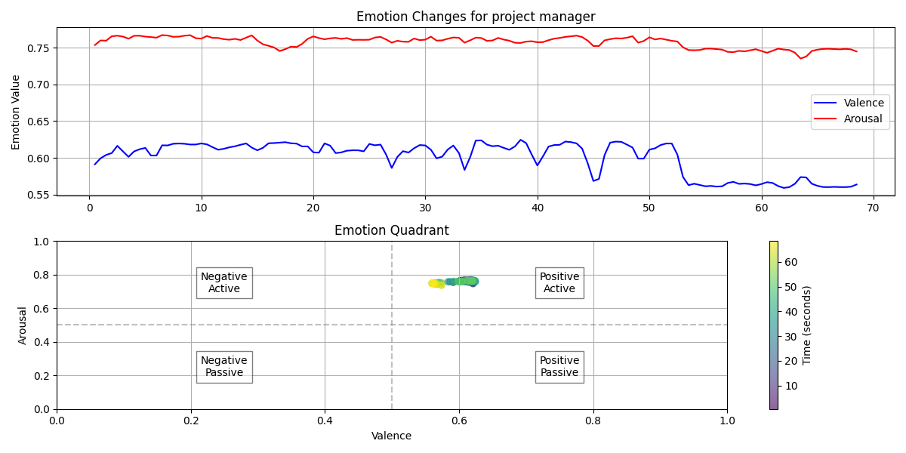
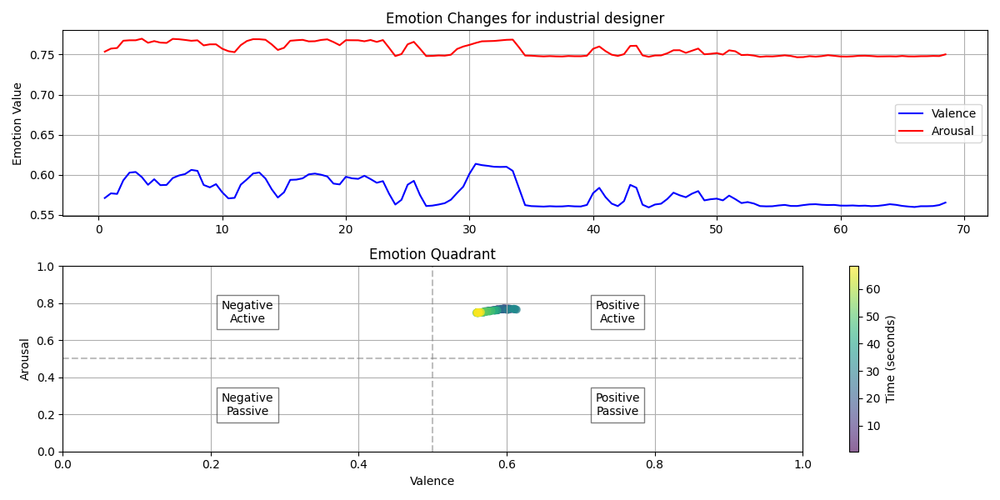
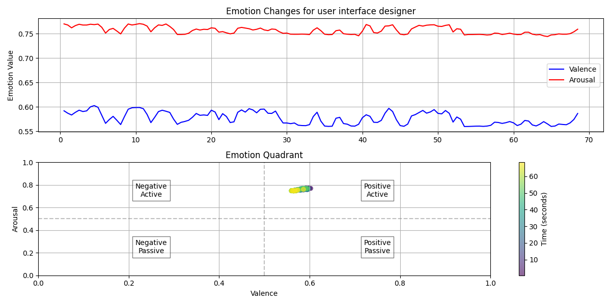
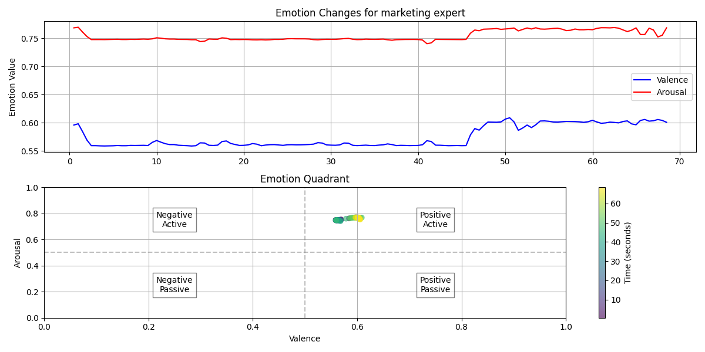

# ES2016a Meeting Analysis Report

## Participant Emotion Analysis Summary

| Role | Average Valence | Average Arousal | Main Emotion Quadrant | Emotional Variability |
|------|----------------|-----------------|----------------------|----------------------|
| project manager | 0.600 | 0.757 | Positive Active | 0.015 |
| industrial designer | 0.577 | 0.756 | Positive Active | 0.012 |
| user interface designer | 0.577 | 0.757 | Positive Active | 0.010 |
| marketing expert | 0.575 | 0.754 | Positive Active | 0.014 |

## Detailed Analysis

### project manager

- Video: ES2016a.Closeup4
- Audio: ES2016a.Headset-0

**Summary**: This participant's emotions are mainly in the Positive Active quadrant, with average valence of 0.600 and average arousal of 0.757. There is low emotional variability, indicating stable emotions throughout the meeting.

### industrial designer

- Video: ES2016a.Closeup3
- Audio: ES2016a.Headset-1

**Summary**: This participant's emotions are mainly in the Positive Active quadrant, with average valence of 0.577 and average arousal of 0.756. There is low emotional variability, indicating stable emotions throughout the meeting.

### user interface designer

- Video: ES2016a.Closeup2
- Audio: ES2016a.Headset-2

**Summary**: This participant's emotions are mainly in the Positive Active quadrant, with average valence of 0.577 and average arousal of 0.757. There is low emotional variability, indicating stable emotions throughout the meeting.

### marketing expert

- Video: ES2016a.Closeup1
- Audio: ES2016a.Headset-3

**Summary**: This participant's emotions are mainly in the Positive Active quadrant, with average valence of 0.575 and average arousal of 0.754. There is low emotional variability, indicating stable emotions throughout the meeting.

